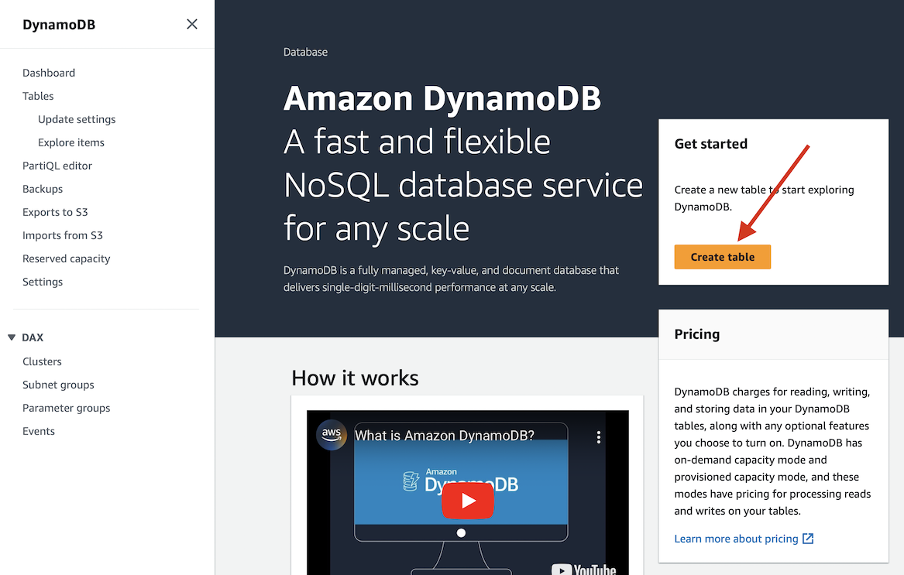
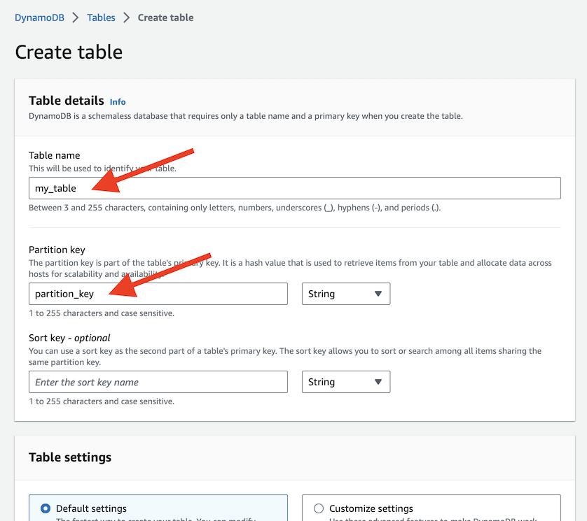
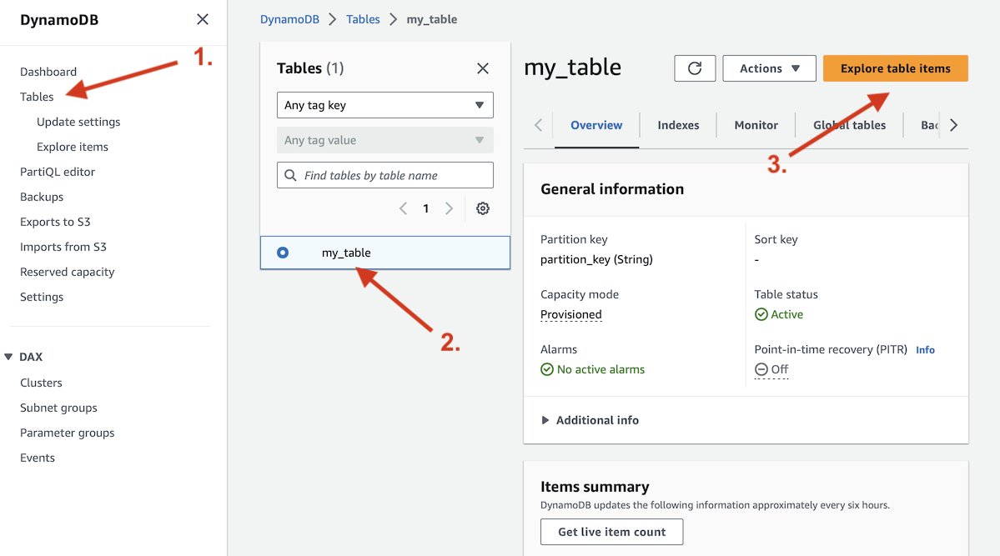
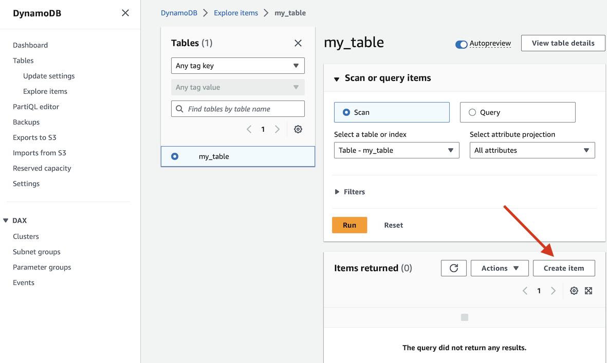
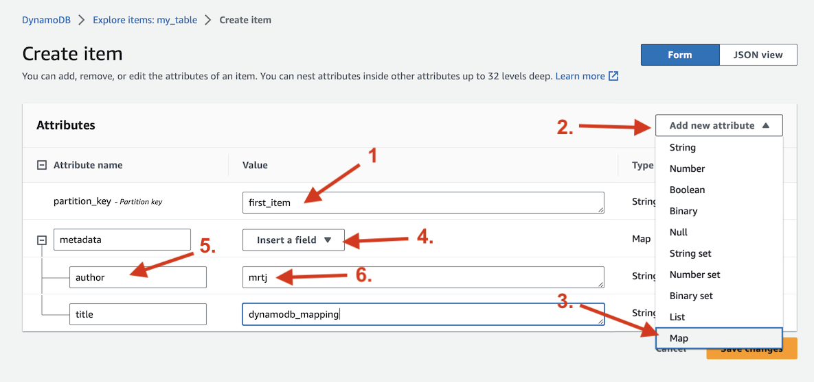

# Create a DynamoDB table and add some data

First, [sign up for AWS](https://aws.amazon.com/) or log in. Go to the [DynamoDB console](http://console.aws.amazon.com/dynamodb/home) and create a new table:

Enter a name of your table and the partition key:

Leave all other settings to the default values, and click "Create table" on the bottom of the page.

> *Note:* DynamoDB is a payed service, but at the time of the writing AWS offers a generous [free tier](https://aws.amazon.com/dynamodb/) that should cover most experiments and personal projects.

After some minutes your table will be created and you can add some data. In the DynamoDB console select your table, and click on the "Explore table items" button.

DynamoDB will run a query for all items in your table. As your table is currently empty, zero items will be returned, but you can click on the "Create item" button on the "Items returned" panel to create a new item.

On the "Create Item" page, you are required to at least fill out the partition_key value, and you have the freedom to add attributes of any supported type. In the example below, I included a new attribute named "metadata" of the "Map" type, which is a data structure akin to a Python dictionary. You also have the option to add attributes of the list type or any other supported primitive types.

You can repeat the last two steps to create more items in your database, optionally with different attributes.
